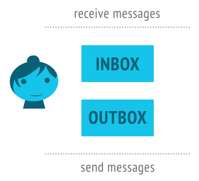
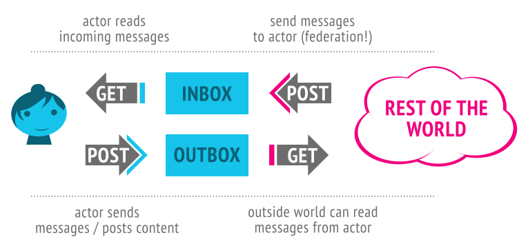
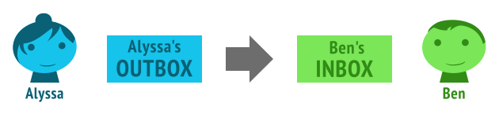
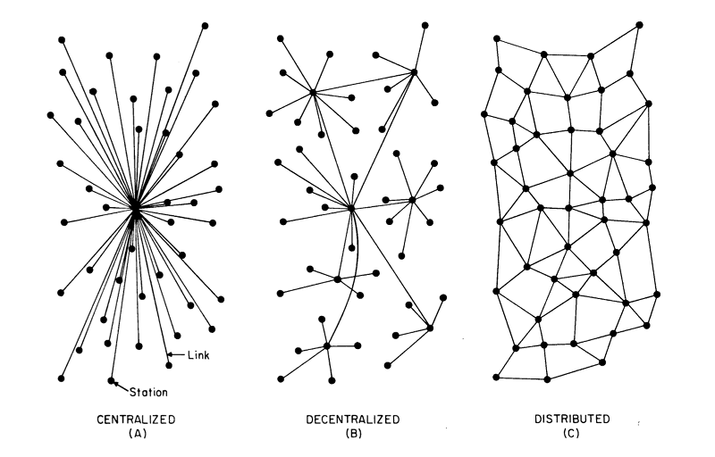

原文见 [ActivityPub: from decentralized to distributed social networks](https://github.com/WebOfTrustInfo/rwot5-boston/blob/master/final-documents/activitypub-decentralized-distributed.md)

*本文最初是为 2017 年重启信任网络峰会而撰写的*

**贡献者**
* Christine Lemmer-Webber，独立人士
* Manu Sporny，Digital Bazaar

## 介绍

[ActivityPub](https://www.w3.org/TR/activitypub/) 是一项正在开发的 [W3C](https://www.w3.org/) 协议，其目的是建立联邦社会系统。用户可以使用 ActivityPub 的实现，如 Mastodon 和 MediaGoblin，来替代诸如 Facebook、Twitter、YouTube 和 Instagram 等大型孤岛式社交网络系统。<sup id="fnr.1">[1](#fn.1)</sup>

总的来说，虽然 ActivityPub 遵循万维网上流行的“客户端-服务端”模式，但它实现了一定程度的去中心化。目前，ActivityPub 的实现已经达到了类似于电子邮件的去中心化水平<sup id="fnr.2">[2](#fn.2)</sup>，但还有很多机会可以更进一步。

通过将公钥附加到网络参与者（用户）的身份中，并使用[链接数据签名（Linked Data Signatures）](https://w3c-dvcg.github.io/ld-signatures/)，我们可以将信任的网络添加到联合社交网络，并使用它来增强用户隐私和维护通过该网络所发送消息的完整性。

通过使用去中心化的标识符系统，例如[去中心化标识符（Decentralized Identifiers，简称 DIDs）](https://w3c-ccg.github.io/did-spec/)，我们可以避开 DNS 和 SSL 证书颁发机构的核心中心化机制，完全地从去中心化系统迁移到分布式系统<sup id="fnr.3">[3](#fn.3)</sup>。

至此，用户甚至可以选择从“客户端-服务端”模型系统转换到完全的 P2P 系统。

## ActivityPub 概述

*此部分借用了 ActivityPub 标准的概述部分。如果你已经熟悉 ActivityPub，则可以跳过此部分。*

ActivityPub 提供两层：

- **服务器到服务器的联合协议：** 去中心化的网站之间共享信息。
- **客户端到服务器的协议：** 用户通过手机、桌面、Web 应用程序或其他方式使用服务器与 ActivityPub 通信。

ActivityPub 实现可以选择只实现其中一项，也可以同时实现这两项。

然而，一旦你实现了一个，实现另一个就不需要太多的步骤，而且两者都有很多好处（使你的网站成为去中心化社交网络的一部分，并能够使用在各种社交网站上工作的客户端和客户端库）。

在 ActivityPub 中，每个参与者（此处将用户称为“参与者”）都有：

- 一个 **收件箱**：他们如何从世界上获得信息？
- 一个 **发件箱**：他们是如何向别人传递信息的？



这些是端点，或者，换言之，只是在 ActivityPub 参与者的 ActivityStreams 描述中所列出的 URL。（稍后将详细介绍 ActivityStreams）

下面是我们的朋友 Alyssa P.Hacker 的记录：

``` json
    {"@context": "https://www.w3.org/ns/activitystreams",
     "type": "Person",
     "id": "https://social.example/alyssa/",
     "name": "Alyssa P. Hacker",
     "preferredUsername": "alyssa",
     "summary": "Lisp enthusiast hailing from MIT",
     "inbox": "https://social.example/alyssa/inbox/",
     "outbox": "https://social.example/alyssa/outbox/",
     "followers": "https://social.example/alyssa/followers/",
     "following": "https://social.example/alyssa/following/",
     "liked": "https://social.example/alyssa/liked/"}
```

ActivityPub 使用 [ActivityStreams](https://www.w3.org/TR/activitystreams-core/) 来作为其[词汇](https://www.w3.org/TR/activitystreams-vocabulary/)。这非常棒，因为 ActivityStreams 包含了表示社交网络中所有活动和内容所需的所有常用术语。

很可能 ActivityStreams 已经包含了你需要的所有词汇，但即使它没有，ActivityStreams 也可以通过 [JSON-LD](https://json-ld.org/) 进行扩展。

如果你知道 JSON-LD 是什么，就可以利用 JSON-LD 提供的超酷的关联数据方法。如果你不了解，请不要担心，JSON-LD 文档和 ActivityStreams 可以理解为简单的 JSON。（如果你要添加扩展，那么这是 JSON-LD 可以真正帮助你的地方。）

所以，好吧。艾丽莎想和她的朋友说话，她的朋友也想和她说话。好消息是，这些“收件箱”和“发件箱”的可以帮助我们。对于 GET 和 POST，它们的行为均不相同。



所以完整的工作流程是：

-   你可以 POST 到某人的收件箱，以向其发送消息（仅限服务器到服务器/联盟…这*是*联盟！）
-   你可以 GET 你的收件箱，以读取最新的邮件（客户端到服务器；这就像阅读你的社交网络流一样）
-   你可以 POST 到你的发件箱，向全世界发送消息（客户端到服务器）
-   你可以 GET 某人的发件箱，查看他们发布的消息，或者至少是你有权查看的消息。（客户端到服务器或服务器到服务器）

当然，如果上述最后一项（从某人的发件箱中 GET 消息）是查看人们发送的内容的唯一方法，那么这将不是一个非常有效的联合协议！实际上，联合通常体现为服务器将参与者发送的消息发布到其他参与者所在的其他服务器收件箱。

让我们来看一个例子！假设 Alyssa 想要联系她的朋友 Ben Bitdiddle。她最近借给他一本书，她想确保他把书还给她。下面是她作为 ActivityStreams 对象编写的消息：

``` json
    {"@context": "https://www.w3.org/ns/activitystreams",
     "type": "Note",
     "to": ["https://chatty.example/ben/"],
     "attributedTo": "https://social.example/alyssa/",
     "content": "Say, did you finish reading that book I lent you?"}
```

这是写给 Ben 的便条，她把它 POST 到她的发件箱里。


由于这不是一个活动对象，服务器会识别出这是一个新创建出来的对象，并且会友好地将其包装在 Create 活动中。（ActivityPub 中发送的活动（activity）通常遵循某个参与者在某个对象上执行的某个活动的模式。在这种情况下，该活动是创建（Create）由某人发布的 Note 对象。）

``` json
    {"@context": "https://www.w3.org/ns/activitystreams",
     "type": "Create",
     "id": "https://social.example/alyssa/posts/a29a6843-9feb-4c74-...",
     "to": ["https://chatty.example/ben/"],
     "actor": "https://social.example/alyssa/",
     "object": {"type": "Note",
                "id": "https://social.example/alyssa/posts/49e2d03d-b53a-4c4c-...",
                "attributedTo": "https://social.example/alyssa/",
                "to": ["https://chatty.example/ben/"],
                "content": "Say, did you finish reading that book I lent you?"}}
```

Alyssa 的服务器找到 Ben 的 ActivityStreams 参与者对象，找到他的收件箱端点，并将她的创建的对象 POST 到他的收件箱。


从技术上讲，这是两个独立的步骤。一种是客户端到服务器的通信，另一种是服务器到服务器的通信（联合）。但是，由于我们在本例中同时使用了它们，我们可以抽象地认为这是从发件箱到收件箱的简化提交过程。



过了一会儿，Alyssa 检查她收到了哪些新消息。她的手机通过 GET 轮询她的收件箱，在朋友们发布的一堆猫咪视频和她姐姐发布的侄子的照片中，她看到了<sup id="fnr.4">[4](#fn.4)</sup>以下内容：

``` json
    {"@context": "https://www.w3.org/ns/activitystreams",
     "type": "Create",
     "id": "https://chatty.example/ben/p/51086",
     "to": ["https://social.example/alyssa/"],
     "actor": "https://chatty.example/ben/",
     "object": {"type": "Note",
                "id": "https://chatty.example/ben/p/51085",
                "attributedTo": "https://chatty.example/ben/",
                "to": ["https://social.example/alyssa/"],
                "inReplyTo": "https://social.example/alyssa/posts/49e2d03d-b53a-...",
                "content": "Argh, yeah, sorry, I'll get it back to you tomorrow.
                            I was reviewing the section on register machines,
                            since it's been a while since I wrote one."}}
```

Alyssa 松了一口气，点赞了 Ben 的帖子：

``` json
    {"@context": "https://www.w3.org/ns/activitystreams",
     "type": "Like",
     "id": "https://social.example/alyssa/posts/5312e10e-5110-42e5-...",
     "to": ["https://chatty.example/ben/"],
     "actor": "https://social.example/alyssa/",
     "object": "https://chatty.example/ben/p/51086"}
```

她将此消息 POST 到她的发件箱。（因为这是一个活动，所以她的服务器知道不需要将其包装在创建对象中。）她对事情的发展感到高兴，决定向她的关注者发布一条公共消息。很快，下面的信息就会被她的追随者集合中的所有成员看到，因为它有一个特殊的公共群组地址，所以任何人都可以阅读。

``` json
    {"@context": "https://www.w3.org/ns/activitystreams",
     "type": "Create",
     "id": "https://social.example/alyssa/posts/9282e9cc-14d0-42b3-...",
     "to": ["https://social.example/alyssa/followers/",
            "https://www.w3.org/ns/activitystreams#Public"],
     "actor": "https://social.example/alyssa/",
     "object": {"type": "Note",
                "id": "https://social.example/alyssa/posts/d18c55d4-8a63-4181-...",
                "attributedTo": "https://social.example/alyssa/",
                "to": ["https://social.example/alyssa/followers/",
                       "https://www.w3.org/ns/activitystreams#Public"],
                "content": "Lending books to friends is nice.
                            Getting them back is even nicer! :)"}}
```

## 将公钥加密引入联合社交网络

我们可以通过让系统上的每个参与者持有公钥和私钥对，并让参与者将其公钥直接附加到其参与者对象，来显著改善联合社交网络的状态：

``` json
    {"@context": ["https://www.w3.org/ns/activitystreams",
                  "https://w3id.org/security/v1"],
     "id": "https://schemers.example/u/alyssa",
     "type": "Person",
     "name": "Alyssa P. Hacker",
     "publicKey": [{
        "id": "https://schemers.example/u/alyssa#main-key",
        "owner": "https://schemers.example/u/alyssa",
        "publicKeyPem": "-----BEGIN PUBLIC KEY-----\r\n..."}]}
```

这为系统提供了显著的改进，我们将在下面进行探讨。

### 签名对象

分享消息在社交网络中很常见。但你怎么能证实某人真的说了那些话呢？

用户 Mallet 试图在他们的社交网络中制造混乱。他们假装“分享”<sup id="fnr.5">[5](#fn.5)</sup>下面的帖子，他们声称这是 Alyssa 发送给意大利面爱好者社区的，Ben 正好是该团体的成员。

``` json
    {"@context": "https://www.w3.org/ns/activitystreams",
     "type": "Announce",
     "id": "https://havoc.example/~mallet/p/90815",
     "to": ["https://pastalovers.example/groups/pasta-enthusiasts/"],
     "actor": "https://havoc.example/~mallet/",
     "object": {"type": "Note",
                "id": "https://social.example/alyssa/posts/63cc87ec-416e-437d-...",
                "attributedTo": "https://social.example/alyssa/",
                "to": ["https://havoc.example~mallet/"],
                "content": "Tortellini is a poor and disgusting imitation of ravioli.
                            Any chef serving tortellini should hang up their aprons
                            in disgrace and never cook again.",
                "signature": {
                  "type": "RsaSignature2017",
                  "creator": "https://social.example/alyssa/",
                  "created": "2017-09-23T20:21:34Z",
                  "nonce": "e3689a56da9b4bc",
                  "signatureValue": "mJfe5OCb7J3WwI...8t5/m="}},
     "signature": {
       "type": "RsaSignature2017",
       "creator": "https://social.example/alyssa/",
       "created": "2017-09-23T21:32:21Z",
       "nonce": "22e8e7683f56c08bb873",
       "signatureValue": "wTjLtnZVYF79pq9Ts...OU1jYPSjvcE2jNc="}}
```

Ben 的服务器，甚至是托管 `pastalovers.example` 的服务器，都可以根据 Alyssa 的 Actor 对象上列出的 `publicKey` 检查签名。这次检查失败了，所以 Mallet 在意大利面爱好者社区中诽谤 Alyssa 的企图失败了。虽然上面的示例着眼于防止恶意交互，但出于积极正面的原因，转发和共享内容是可取的。

在支持私人互动的联合社交网络中，一个常见的问题是对话可能会变得支离破碎：如果 Ben 发布消息到他组建的私人集合<sup id="fnr.6">[6](#fn.6)</sup>中，该集合中包含他的朋友和同事，而同事的成员无法看到私人集合中的人，当他们在对话中包含该集合时，他们无法遍历集合中的参与者以便将消息传递给所有相关的参与者。（这种“幽灵回复”问题在联合网络上经常发生，即使是在将消息发送到参与者自己 `followers` 的网络时也是如此，在这种情况下，中断往往会跨服务器边界发生。）

ActivityPub 通过 [转发机制（forwarding mechanism）](https://www.w3.org/TR/activitypub/#inbox-delivery) 提供了一个解决方案，但该解决方案在没有签名的情况下无法真正工作，因为转发是间接发生的，而不是来自“同一来源/域”，因此服务器无法检查/信任内容是否如其声明的那样。即使接收服务器尝试查找接收参与者的凭据，也可能没有为转发到的参与者启用访问控制，因为评论者无法知道谁在私有集合中，以至于无法启用对接受者的访问。

这是联合社交网络中经常要求的功能，因此我们应该确保提供了必要的公钥基础设施。<sup id="fnr.7">[7](#fn.7)</sup>

### 一个更容易使用的信任网络？

PGP 风格的“信任网络”已经存在了一段时间，但“信任网络”（web of trust）一词在某种程度上被历史上最流行的 trust network 的填充方法所束缚。基于密钥签名的网络，虽然有效，但从未在极少数人之外取得成功。这样的网络是有意义的，但对于大多数人来说，很难去加入和组织，更困难的是学习参与系统所需的（通常是）命令行工具。虽然在这方面已经做了一些工作（例如使用 [Monkeysign](https://monkeysign.readthedocs.io/en/2.x/) 和 [Gibberbot](https://guardianproject.info/apps/gibber/)），但如果建立你的信任网络是参与网络的附带条件，那就更好了。<sup id="fnr.8">[8](#fn.8)</sup>

在某种程度上，在目前已经存在的 ActivityPub 部署中，这可能是“免费的，但需注意”，其中订阅和对象查找是通过 HTTPS 完成的。仅仅通过发送关注（follow）请求（或在社交图上连接用户的一些其他动作），就可以表达用户之间的一定量的信任。密钥可以在参与者个人资料 URL 中查找和记录，用户甚至可以观察和分享他们在社交网络上认识的其他人的信息。

有一个重要的警告：使用 HTTPS 进行这些查找需要信任 SSL 证书颁发机构。聊胜于无，但它并不伟大，也不是我们想要的分布式系统。此外，恶意参与者仍然可以欺骗用户；用户可能相信他们正在订阅 `https://social.example/alyssa/`，但也许 Mallet 欺骗他们，使他们订阅了 `https://social.example/alyssaa/`。<sup id="fnr.9">[9](#fn.9)</sup>

令人振奋的是，还有其他方法可以鼓励建立更强大的信任网络。Carl Ellison 的论文 *[在没有证书颁发机构的情况下建立身份（Establishing Identity Without Certification Authorities）](http://world.std.com/~cme/usenix.html)* 描述了用户之间的几类关系，并且许多 Off The Record 客户端（例如在 Pidgin 中可用的客户端等）提供了用于验证用户的接口。联合社交网络上的用户可以使用文本校验，执行简短的视频通话，校验共享代码（如在 Jitsi 中所做的），或扫描 QR 码（如在 Monkeysign 和 Gibberbot 中），以建立更强的信任，即网络上的参与者是他们声称的实体。所获得的信任级别可以被签名、记录，并在整个网络中适当地传播。即使在像 DIDs 这样的系统中，这种机制也能很好地工作，因为不存在人类可读的标识符。

### 端到端加密

恶意服务器管理员仍然可以窥探系统上参与者的所有通信。即使管理员没有恶意，也可能被迫窥探其用户，或者可能在其不知情的情况下使其整个系统受到危害。SSL 证书颁发机构也可能被入侵，发出伪造的证书，从而允许用户和服务器管理员都不知道的中间人攻击。

端到端加密可以解决这个问题（需要进行一些权衡）。在这种情况下，不是让服务器管理用户的公钥和私钥，而是用户可以在他们的参与者对象上提供公钥，只有他们自己的计算机持有相应的私钥。然后，网络上的其他参与者可以将加密的对象发送到该参与者的收件箱。例如，参与者可能会在收件箱中收到以下对象<sup id="fnr.10">[10](#fn.10)</sup>：

``` json
    {"@context": ["https://securityns.example/",
                  "https://www.w3.org/ns/activitystreams"],
     "type": "EncryptedEnvelope",
     "encryptedMessage": "-----BEGIN PGP MESSAGE-----\r\n...",
     "mediaType": "application/ld+json; profile=\"https://www.w3.org/ns/activitystreams\""}
```

服务器会将该对象放入用户的收件箱中，但如果只有用户自己的计算机持有该密钥，则即使服务器也无法读取信封中的内容。

在通过“客户端到服务器”协议从服务器检索对象时，用户的客户端可以解密消息。在这种情况下，邮件直接进入了 Alyssa 的收件箱。在解密 EncryptedMessage 中的组件时，会找到另一个对象：

``` json
    {"@context": "https://www.w3.org/ns/activitystreams",
     "type": "Note",
     "id": "https://chatty.example/ben/p/86187",
     "to": ["https://social.example/alyssa/"],
     "attributedTo": "https://chatty.example/ben/",
     "content": "Up for some root beer floats at my friend's house?
                 Here's the address: ..."}
```

请注意，虽然这提高了隐私性，但也带来了几个缺点：

-   ActivityPub 包含一整套[服务器端的副作用（server side side-effects）](https://www.w3.org/TR/activitypub/#server-to-server-interactions)用于联合社交网络上的常见活动。例如，Like 对象将增加帖子被赞的计数器，并且甚至将该 Like 对象添加到用户的喜欢对象集合以及喜欢该对象的所有用户的集合中。由于服务器无法观察通过网络发送的数据，因此这些副作用将被破坏。服务器也将无法提供其他功能，例如，为了便于搜索，对消息进行基于服务器的索引。<sup id="fnr.11">[11](#fn.11)</sup>

-   在更 P2P 的系统中（如分布式标识部分中所讨论的），这变得不那么重要了，因为客户端和服务器之间的区别变得模糊了。然而，对于现有的客户端到服务器实现，这是一个需要考虑的重要问题。

-   众所周知，在端到端加密系统中，用户对密钥的维护是一个很难的用户体验问题。

-   密钥恢复更加困难。[DIDs](https://w3c-ccg.github.io/did-spec/) 提出了一个密钥恢复的方法，但是如果用户不再拥有旧消息的密钥，或者原始的发送者无法重新发送密钥（或者不知道如何发送密钥），那么这也无法帮助用户读取那些旧消息。

## 分布式身份

目前的 ActivityPub 实现依赖于 HTTPS 作为其传输层，而 HTTPS 又依赖于两个集中式系统：DNS 和 SSL 证书颁发机构。有没有办法将自我主权带到联合社交网络中？

好消息是，是有的。ActivityPub 是特意写成了可以基于任何支持 HTTP GET 和 POST 动词的协议。该[分布式标识符](https://w3c-ccg.github.io/did-spec/)规范看起来非常适合 ActivityPub。

最简单的版本可以简单地通过使用 DID 替换参与者 ID 来实现。转换一个概述中的示例：

``` json
    {"type": "Note",
     "attributedTo": "https://social.example/alyssa/",
     "to": ["https://chatty.example/ben/"],
     "content": "Say, did you finish reading that book I lent you?"}
```

转换成：

``` json
    {"type": "Note",
     "attributedTo": "did:example:d20Hg0teN72oFeo0iNYrblwqt",
     "to": ["did:example:nJx2fgreaSfCujA0kMsiEW8Oz"],
     "content": "Say, did you finish reading that book I lent you?"}
```

天哪！那很简单。我们所做的只是将代表用户的人类可读标识符替换为 DID.如果我们查找基于 Alyssa 的[DID](https://w3c-ccg.github.io/did-spec/#dids-(decentralized-identifiers)）的 ID，我们可以检索她的参与者对象作为 [DDO](https://w3c-ccg.github.io/did-spec/#ddos-(did-descriptor-objects)），但这次有额外的信息：

``` javascript
    {
      "@context": ["https://example.org/did/v1",
                   "https://www.w3.org/ns/activitystreams"],
      "id": "did:example:d20Hg0teN72oFeo0iNYrblwqt",
      "activityPubService": {
        "id": "did:example:d20Hg0teN72oFeo0iNYrblwqt#services/ActivityPub",
        // ActivityPub actor information
        "type": "Person",
        "name": "Alyssa P. Hacker",
        "preferredUsername": "alyssa",
        "summary": "Lisp enthusiast hailing from MIT",
        "inbox": "https://9GaksjPhy0mWToTV.onion/alyssa/inbox/",
        "outbox": "https://9GaksjPhy0mWToTV.onion/alyssa/outbox/",
        "followers": "https://9GaksjPhy0mWToTV.onion/alyssa/followers/",
        "following": "https://9GaksjPhy0mWToTV.onion/alyssa/following/",
        "liked": "https://9GaksjPhy0mWToTV.onion/alyssa/liked/"},
      // DDO information
      "owner": [{
        "id": "did:example:d20Hg0teN72oFeo0iNYrblwqt#key-1",
        "type": ["CryptographicKey", "EdDsaPublicKey"],
        "curve": "ed25519",
        "expires": "2017-02-08T16:02:20Z",
        "publicKeyBase64": "lji9qTtkCydxtez/bt1zdLxVMMbz4SzWvlqgOBmURoM="
      }, {
        "id": "did:example:d20Hg0teN72oFeo0iNYrblwqt#key-2",
        "type": ["CryptographicKey", "RsaPublicKey"],
        "expires": "2017-03-22T00:00:00Z",
        "publicKeyPem": "----BEGIN PUBLIC KEY-----\r\n.."
      }],
      "control": [{
        "type": "OrControl",
        "signer": [
            "did:example:d20Hg0teN72oFeo0iNYrblwqt",
            "did:example:8uQhQMGzWxR8vw5P3UWH1j"
        ]
      }],
      "created": "2002-10-10T17:00:00Z",
      "updated": "2016-10-17T02:41:00Z",
      "signature": {
        "type": "RsaSignature2016",
        "created": "2016-02-08T16:02:20Z",
        "creator": "did:example:8uQhQMGzWxR8vw5P3UWH1j#key/1",
        "signatureValue": "IOmA4R7TfhkYTYW8...CBMq2/gi25s="
      }
    }
```

呼！这是一个很大的补充。除了这里我们看到一个例子，Alyssa 的身份完全摆脱了传统的集中式的 DNS 机构。我们可以通过她的 DID 查找 Alyssa 的对象，但我们仍然可以访问她的所有端点，在这种情况下指向[Tor Hidden Services](https://www.torproject.org/docs/hidden-services.html.en)。无需中央 DNS！

也许将来甚至会有一种协议——让我们称它为 `httpeer`——它支持所有标准的 HTTP 版本，但是基于其他一些 P2P 网络。DID 规范支持[服务端点](https://w3c-ccg.github.io/did-spec/#service-endpoint-references-(optional)），Alyssa 可以利用这些来使用她的 DID 作为 `outbox`、`inbox` 等 URI 的基础。下面是上一个示例的删减和修改版本：

``` javascript
    {
      "@context": ["https://example.org/did/v1",
                   "https://www.w3.org/ns/activitystreams"],
      "id": "did:example:d20Hg0teN72oFeo0iNYrblwqt",
      "activityPubService": {
        "id": "did:example:d20Hg0teN72oFeo0iNYrblwqt#services/ActivityPub",
        // ActivityPub actor information
        "type": "Person",
        "name": "Alyssa P. Hacker",
        "preferredUsername": "alyssa",
        "summary": "Lisp enthusiast hailing from MIT",
        "inbox": "did:example:d20Hg0teN72oFeo0iNYrblwqt/inbox/",
        "outbox": "did:example:d20Hg0teN72oFeo0iNYrblwqt/outbox/",
        "followers": "did:example:d20Hg0teN72oFeo0iNYrblwqt/followers/",
        "following": "did:example:d20Hg0teN72oFeo0iNYrblwqt/following/",
        "liked": "did:example:d20Hg0teN72oFeo0iNYrblwqt/liked/"},
      // DDO information goes here
      "httpeerService": {
        "nodeId": "dI0tuXjISZEadSH6QV9EhBEdccL4ouePdF8P57BJ"}}
```


这就是身份识别系统！

## 仅追加系统和内容寻址存储

最后，值得一提的是将 ActivityPub 移动到一个完全仅追加的内容寻址系统，用于对象存储、“修改”和检索。近年来，这些系统已经取得了很大的成功。实施这一变化将允许联邦系统中的许多副作用被完全消除。我们将此作为未来论文的主题。

## 结论

ActivityPub 在提供一种标准化的方式，将社交网络从孤立、集中的孤岛转向分散的本质方面走了很长一段路，而这正是万维网所要包含的。尽管如此，仍有许多工作要做和改进。然而，试图一下子设计出正确的系统是有风险的，众所周知，“杰出”是“好”的敌人（Great is well known to be the enemy of good）。

值得庆幸的是，我们不需要抛弃我们必须做出的改进，本文中讨论了这些改进。ActivityPub 已经存在并运行，我们可以逐步改进现有的系统，并模糊联合社交网络和更多理想的对等系统之间的界限。通过将公钥基础设施和分布式标识符添加到 ActivityPub 中，我们可以从去中心化系统转变为分布式系统，并真正构建一个既具有自我主权又具有社会性的网络。

## 致谢

感谢 Evan Prodromou 和 Owen Shepherd 对 ActivityPub 标准的初步修订。还要感谢 Jessica Tallon 担任 ActivityPub 的联合编辑和[所有帮助实现 ActivityPub 的人](https://www.w3.org/TR/activitypub/#acknowledgements)，这可不是一个小名单。（其中一些人在 ActivityPub 中包含的原始版本的概述中发现了拼写错误。）

感谢 Manu Sporny 和 Stephen Webber 关于如何使 ActivityPub 成为一个更强大的分布式系统的想法和反馈。感谢 Dave Longley 指出术语“去中心化”和“分布式”的词汇漂移/歧义，这导致添加了 Paul Baran 的图表和一些术语澄清。<sup id="fnr.3">[3](#fn.3)</sup> 感谢 Morgan Lemmer-Webber 的耐心和对本文件的仔细校对。

感谢 Spec-Ops 和 Digital Bazaar 在可验证的声明和凭据方面为我的工作提供的支持。虽然与我在 ActivityPub 上的工作是分开的，但显然我一直在思考如何将它们结合起来。

还要感谢 Mray 在概述部分提供的精美插图。

本文档及其图像（Paul Baran 的图纸除外）与 ActivityPub 本身一样，均根据 [W3C 许可文档许可证](https://www.w3.org/Consortium/Legal/2015/copyright-software-and-document)授权。

## 脚注：

<div className="footdef"><sup><a id="fn.1" name="fn.1" className="footnum" href="#fnr.1">1</a></sup> 当然，没有什么能阻止当前的社交网络孤岛采用 ActivityPub，只要他们愿意打破用户的藩篱。</div>

<div className="footdef"><sup><a id="fn.2" name="fn.2" className="footnum" href="#fnr.2">2</a></sup> 细心的读者可能会注意到，电子邮件不再像以前那样是一个分散的系统。考虑到这一教训，仅有协议是无法构建分布式网络的。社区必须构建和维护数量充足的节点，避免让少数大型提供商控制联合网络的空间。</div>

<div className="footdef"><sup><a id="fn.3" name="fn.3" className="footnum" href="#fnr.3">3</a></sup> 值得花一些时间来讨论“中心式”、“分布式”和“去中心化”的含义。\
 \
在上图中，我们看到了 Paul Baran 在 1964 年关于该主题的论文中的图像，从这些形状中，我们可以看到我们所指的各种形状：社交孤岛类似于轮辐一样的中心化模型，客户端-服务器联合社交网络类似于树状去中心化模型，而 P2P 网络类似于网状分布式模型。自从写那篇论文以来，一直有显著的词汇漂移（也许是因为英语是一种去中心化的/分布式的语言），而且<a href="https://medium.com/@VitalikButerin/the-meaning-of-decentralization-a0c92b76a274">澄清这些术语的含义</a>可能很难。（在<a href="https://ethereum.stackexchange.com/a/7813">以太坊堆栈交易所上的一个热门帖子</a>中，出现了一个与 Baran 的图几乎完全相同的图，但去中心化和分布式标签颠倒了！）本文的目标实际上是找出能够最大程度地提高可靠性、安全性和用户自主性的系统，而所讨论的一些方法（如公钥加密）可以同时提高这两个方面。尽管如此，当使用“去中心化”和“分布式”这两个词时，要找出它们的含义，有时要看看 Baren 的图片比文字更具描述性。</div>

<div className="footdef"><sup><a id="fn.4" name="fn.4" className="footnum" href="#fnr.4">4</a></sup> Alyssa 可能不会像这里描述的那样直接看到 JSON-LD 对象，但作者认为，一些叙述上下文仍然有助于解释 UI 无法描述的协议。</div>

<div className="footdef"><sup><a id="fn.5" name="fn.5" className="footnum" href="#fnr.5">5</a></sup> `Announce` 基本上`分享（Share）`在 ActivityStreams 中。本文作者不对术语负责。</div>

<div className="footdef"><sup><a id="fn.6" name="fn.6" className="footnum" href="#fnr.6">6</a></sup> 在 ActivityPub 中， `Collection` 对象可用于包含对象集。该系统的用户可以在公共或私人可读的集合中管理参与者集合，这些集合可用于分布式对象的寻址（类似于 Google+ 的 Circles 或 Diaspora 的 Aspects）。的确，连参与者的 `followers` 都是 `Collection` 这样的！</div>

<div className="footdef"><sup><a id="fn.7" name="fn.7" className="footnum" href="#fnr.7">7</a></sup> 在存储对象上的签名时，需要做出几个决定，这些对象本身引用了可能发生变化的其他签名对象，这是<a href="https://github.com/w3c-dvcg/ld-signatures/issues/7">目前公开讨论</a>的主题。这可能会激发更多关于仅追加系统和内容寻址存储的工作。在有突变倾向的环境中操作的现有实现必须决定是让引用突变对象的签名失败（在每个父对象上递归地包括这样的对象），还是采用由所见修订存储的对象的某种内容寻址。后两个选项可能会对高度相关的最初设计时没有考虑签名的系统。</div>

<div className="footdef"><sup><a id="fn.8" name="fn.8" className="footnum" href="#fnr.8">8</a></sup> <a href="https://ring.cx/">GNU Ring</a> 是 P2P 社交网络系统的一个有趣的例子，其中用户的身份实际上是他们的指纹。虽然不是第一个有这个概念的系统，但它的运行非常令人愉快（而且界面本身也很美观）。建立你的好友名单相当于从字面上建立你的信任网。</div>

<div className="footdef"><sup><a id="fn.9" name="fn.9" className="footnum" href="#fnr.9">9</a></sup> 有数量惊人的<a href="http://www.unicode.org/Public/security/latest/confusables.txt">Unicode 黑客</a>，即使是最细心的技术用户也会上当受骗。</div>

<div className="footdef"><sup><a id="fn.10" name="fn.10" className="footnum" href="#fnr.10">10</a></sup> <code>https：//securityns.example/</code> 是一个虚构的 JSON-LD 上下文，它仅用作术语<code>EncryptedEnvelope</code>和 <code>EncryptedMessage</code> 的占位符。也许在将来，出现在该文档中的这些术语（也许有更好的名称）会出现在其他上下文/名称空间之中。</div>

<div className="footdef"><sup><a id="fn.11" name="fn.11" className="footnum" href="#fnr.11">11</a></sup> 这与 PGP 包装的电子邮件的工作方式并无不同。接收 PGP 加密的电子邮件意味着网络邮件界面将无法搜索你的邮件。然而，这并不意味着搜索是不可能的；一些程序，如 <a href="http://www.djcbsoftware.nl/code/mu">MU</a> / <a href="https://www.djcbsoftware.nl/code/mu/MU4E.html" >mu4e</a> 可以在用户的本地计算机上的本地索引加密电子邮件并提供此类搜索接口。</div>
